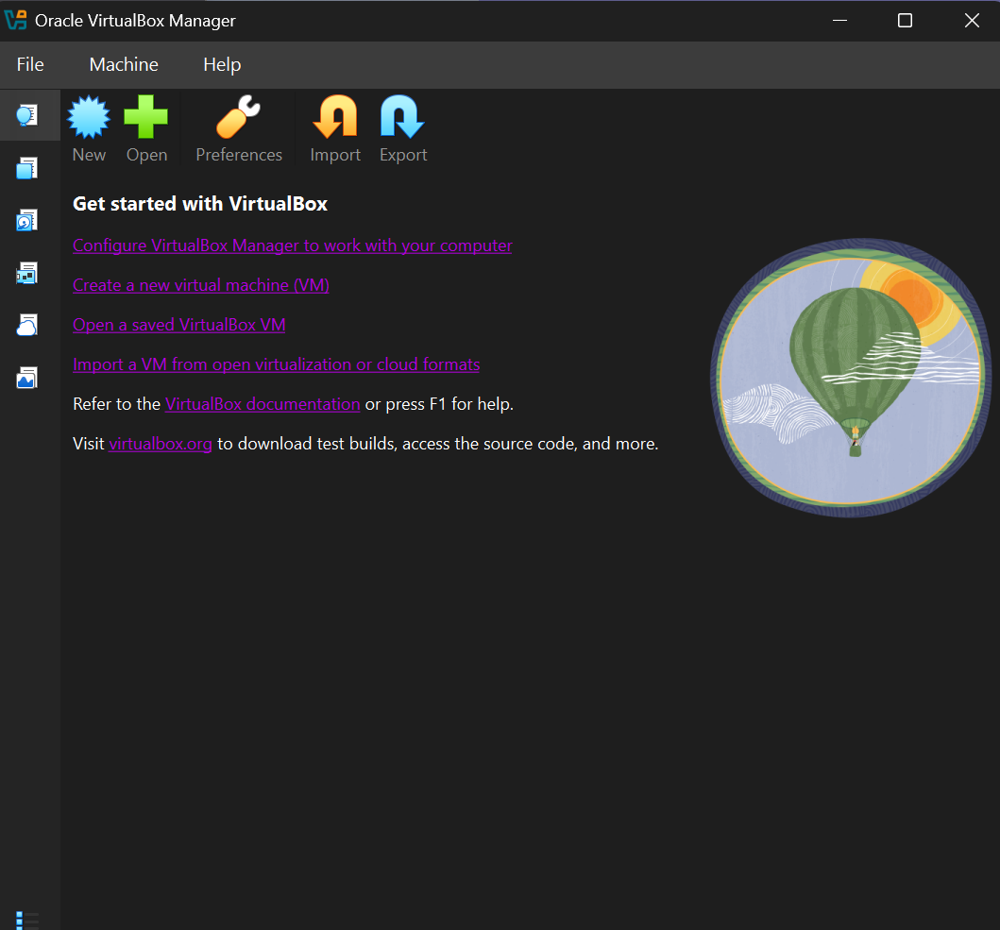
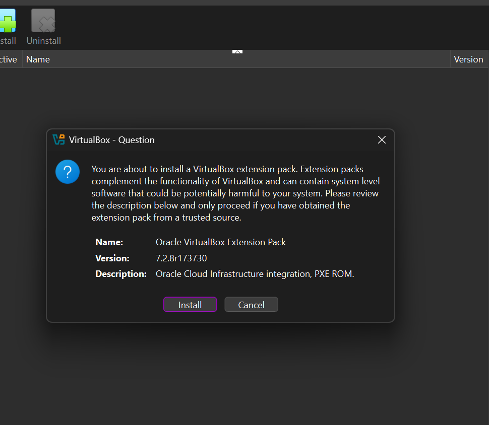
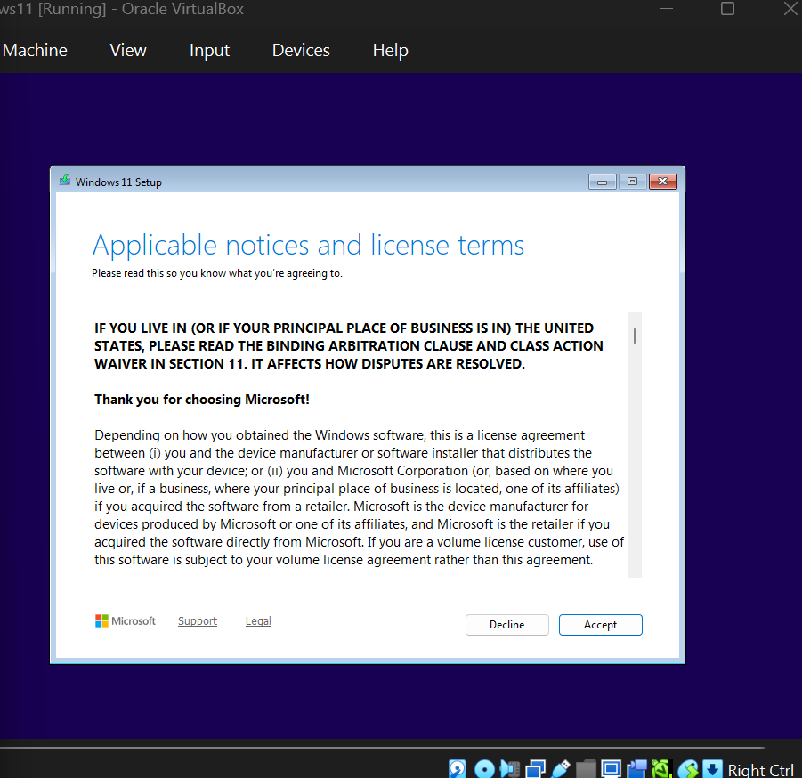
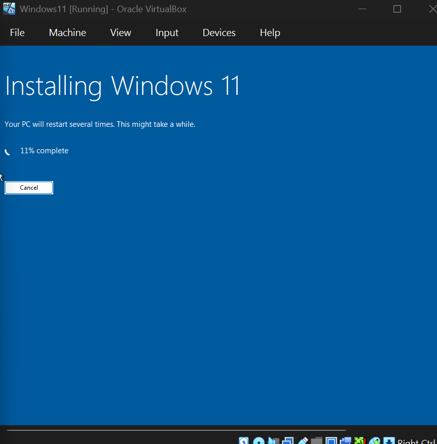
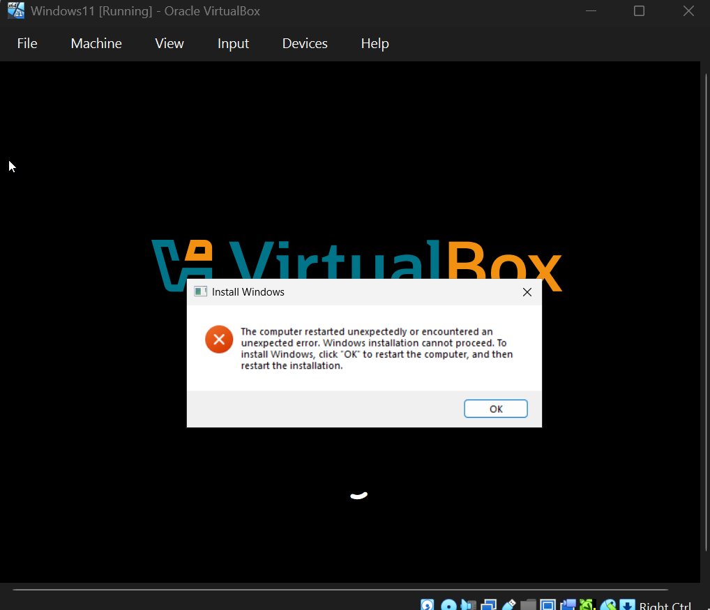
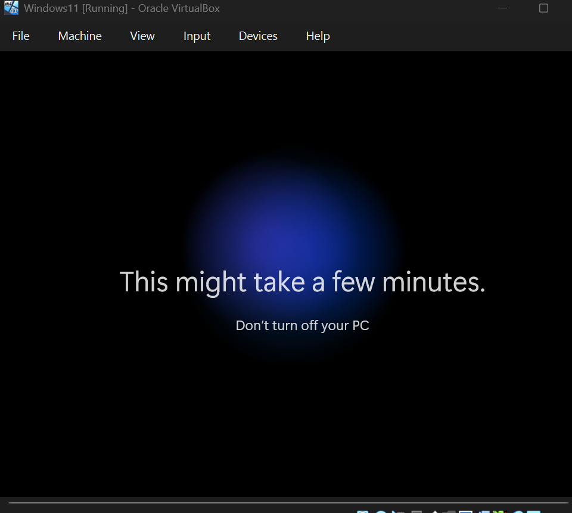
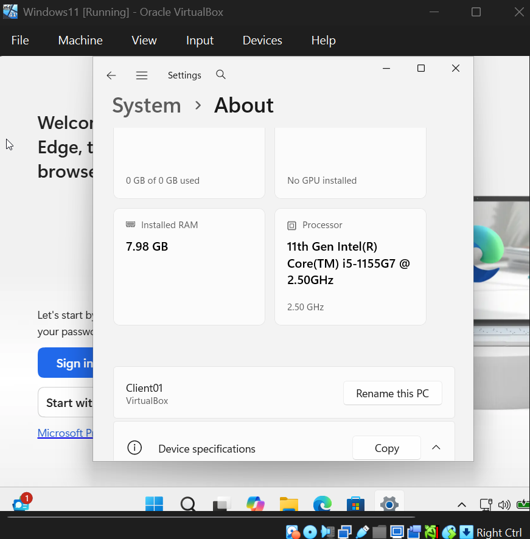

# 02 - Environment Setup

This section documents the installation of the virtualization environment used to host the IT Support Home Lab and the deployment of the first virtual machine, a Windows 11 Enterprise client workstation.

## Overview

The host machine runs Windows 11 with 16 GB RAM and an 11th Gen Intel Core i5 processor with virtualization enabled in BIOS. Oracle VM VirtualBox was selected as the hypervisor for its accessibility, free licensing, and broad community support.

## VirtualBox Installation

Oracle VM VirtualBox 7.x was downloaded from the official Oracle website ([virtualbox.org](https://www.virtualbox.org/wiki/Downloads)) and installed using default settings. After installation, VirtualBox Manager opened to an empty environment, ready for the first virtual machine to be created.

### Extension Pack Installation

The Oracle VM VirtualBox Extension Pack (version 7.2.8) was installed to enable additional functionality including USB 2.0/3.0 device support, RDP server capability, disk encryption, and PXE ROM support for Intel network cards.

## Windows 11 Client VM Creation

A virtual machine was created with the following specifications:

| Setting | Value | Reasoning |
|---------|-------|-----------|
| Name | Client01 | Identifies the VM as a client workstation |
| OS Type | Windows 11 (64-bit) | Matches the ISO being installed |
| RAM | 4096 MB (4 GB) | Above Microsoft's minimum for Windows 11 |
| CPUs | 2 cores | Provides responsive performance for end-user workflows |
| Disk | 60 GB dynamically allocated VDI | Sufficient for OS plus future application installs |
| Network | NAT | Provides internet access through host network |

The Windows 11 Enterprise evaluation ISO was attached to the VM as a virtual optical drive. The VM was then booted from the ISO to begin Windows installation.

After accepting the license terms, the installation proceeded into the file copying phase.

## Issue Encountered: Installation Failure

After the first reboot during Windows 11 setup, the VM encountered a critical error stating the computer restarted unexpectedly and Windows installation could not proceed.

Clicking OK rebooted the VM, which immediately returned to the same error - creating an infinite loop.

### Troubleshooting Approach

I followed a structured troubleshooting methodology, escalating from least disruptive to most disruptive fixes.

**Step 1: Initial Research** - Researched the error message and identified it as a common VM installation failure typically caused by corrupted setup state in the registry or on the virtual disk.

**Step 2: First Fix Attempt - Registry Edit (Failed)** - Attempted the standard fix of pressing Shift+F10 during the error to open Command Prompt, then accessing the Windows registry to modify the setup completion flag. After applying the change and rebooting, the same error reoccurred, indicating the corruption was deeper than the registry flag alone.

**Step 3: Second Fix - Recreate Virtual Disk (Successful)** - With the soft fix unsuccessful, I diagnosed the issue as virtual disk corruption from the interrupted install. I removed the existing virtual hard disk from the VM settings, created a new virtual hard disk file, and reattached it to the VM.

The fresh disk allowed the installer to begin cleanly:

The installation then proceeded to completion.

### Lesson Learned

When VM installation errors persist through soft fixes (registry edits, restart loops), the root cause is usually disk-level corruption. Recreating the virtual disk is faster and more reliable than chasing software-level fixes.

## Issue Encountered: Microsoft Account Bypass

After the install completed and the VM rebooted into Windows 11 Out-of-Box Experience (OOBE), Microsoft's setup wizard required a Microsoft account sign-in to proceed. This is unsuitable for a lab environment because lab VMs should not be tied to personal Microsoft accounts and the requirement complicates future domain-join operations.

### Troubleshooting Approach

The standard `OOBE\BYPASSNRO` command (run from Shift+F10 Command Prompt during OOBE) is the documented bypass for older Windows 11 builds, but it has been progressively removed from newer builds. After confirming BYPASSNRO did not work on this build, I tried the network disconnect method:

**Step 1:** Disconnected the VM's network adapter via VirtualBox menu (Devices, Network, Connect Network Adapter, unchecked).

**Step 2:** Returned to the Microsoft sign-in screen and entered placeholder credentials.

**Step 3:** Microsoft's sign-in service was unreachable due to the disconnected adapter, causing setup to fall back to local account creation.

**Step 4:** Created a local user account with a lab-specific password.

**Step 5:** After reaching the desktop, reconnected the network adapter to restore internet access.

The VM was successfully running Windows 11 with a local administrator account, and the PC was renamed to Client01 to align with the lab's naming convention.

### Lesson Learned

Modern Windows 11 builds aggressively enforce Microsoft account sign-in during OOBE. For domain-joined lab environments, the network disconnect bypass is currently the most reliable method to fall through to local account creation.

## Final State

After this section, the lab has Oracle VM VirtualBox installed and configured, Extension Pack installed for full feature support, Windows 11 Enterprise client VM (Client01) installed and operational, a local administrator account created without Microsoft account binding, network connectivity verified, and the VM ready to be domain-joined once a Domain Controller is built.

## Next Section

03 - Active Directory Setup: Building the Windows Server 2022 Domain Controller and configuring AD DS, DNS, and DHCP.
