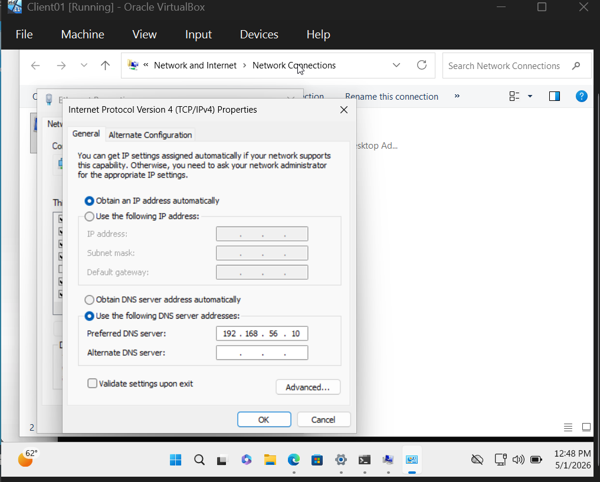
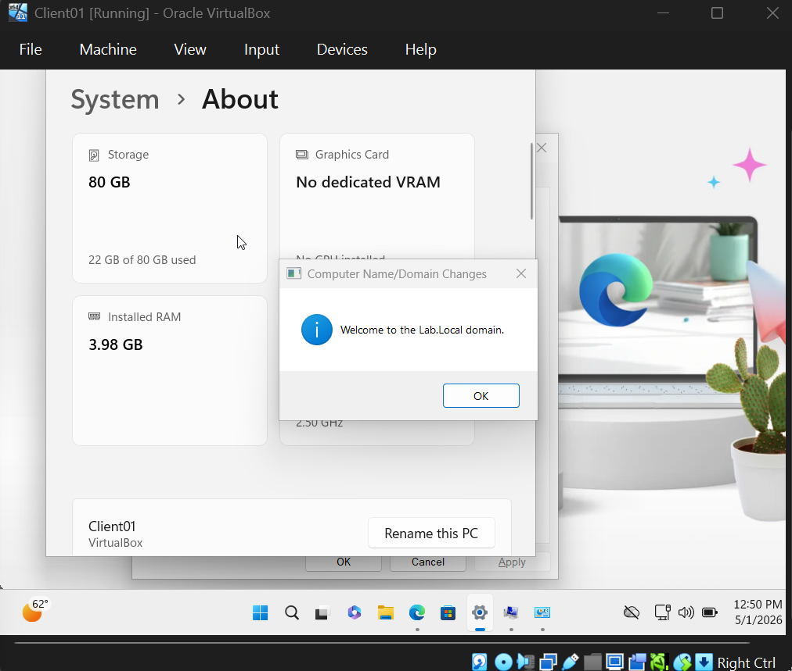
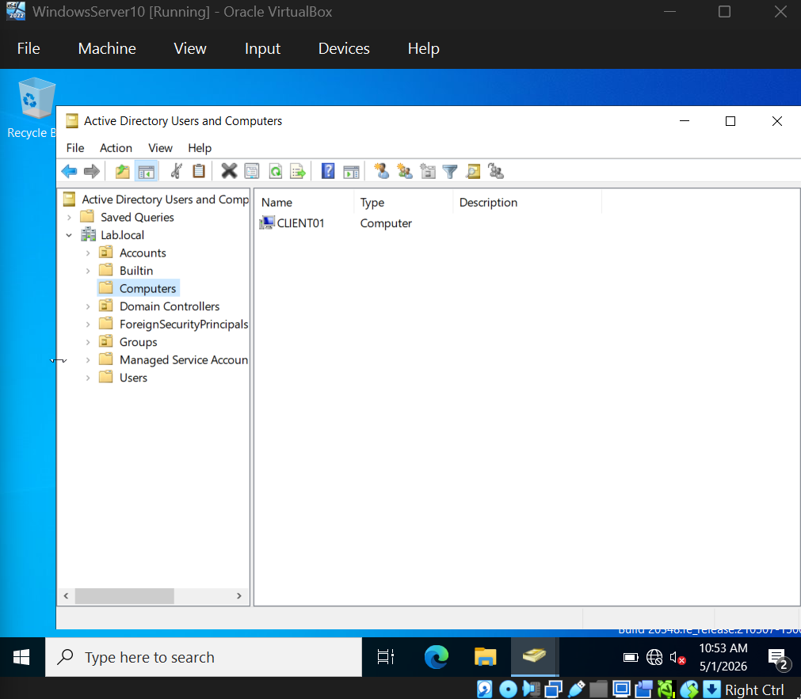

# 04 - Network Configuration, Domain Join & User Management

This section documents the configuration of Client01's network to integrate with the lab.local domain, the actual domain join process, and the creation and management of users, groups, and Organizational Units in Active Directory.

## Overview

After Section 03 established the Domain Controller, this section connects everything together. The Windows 11 client workstation must be configured to use the DC's DNS service before it can locate domain services and join the domain. Once joined, Active Directory becomes the central authority for user authentication and account management - a foundational skill set for any IT Help Desk role.

## Network Configuration on the Client

For the Windows 11 client to find and authenticate against the Domain Controller, its DNS server settings must point to DC01's IP address (192.168.56.10). Without this, the client cannot resolve `lab.local` or locate the Domain Controller's services.

The client's network adapter properties were updated to use the following DNS server:

| Setting | Value |
|---------|-------|
| Preferred DNS Server | 192.168.56.10 (DC01) |
| Alternate DNS Server | (none) |

## Domain Join Process

With DNS correctly configured, the client could resolve `lab.local` and locate DC01. The domain join was performed through System Properties on Client01:

1. Opened System Properties (Win + R, typed `sysdm.cpl`, pressed Enter)
2. Clicked Change on the Computer Name tab
3. Selected Domain instead of Workgroup
4. Entered `lab.local` as the domain name
5. Provided domain administrator credentials when prompted

The join succeeded with a "Welcome to the Lab.Local domain" confirmation:

The client was then restarted to complete the join. After reboot, the login screen showed `LAB\` as the domain prefix, confirming domain membership.

## Verification on the Domain Controller

Back on DC01, opening Active Directory Users and Computers confirmed that CLIENT01 had been registered as a domain-joined computer. It appeared automatically in the default Computers OU:

This is significant because it proves the bidirectional relationship: the client knows about the domain, and the domain knows about the client.
