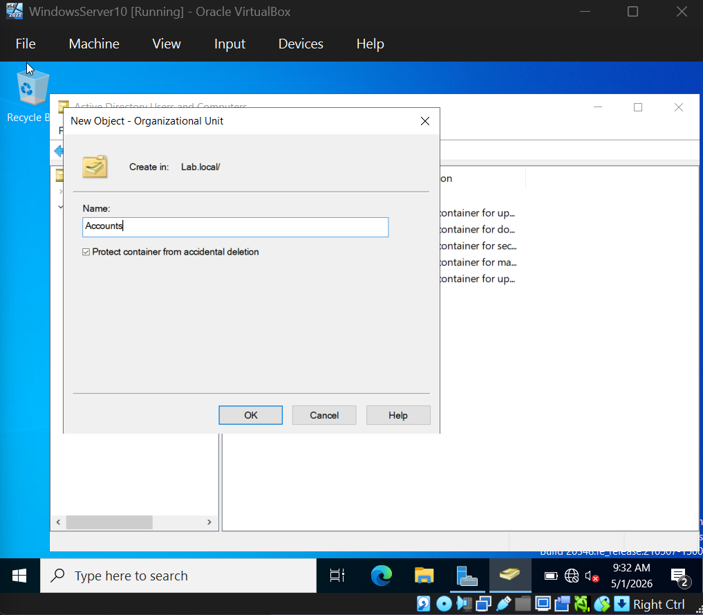
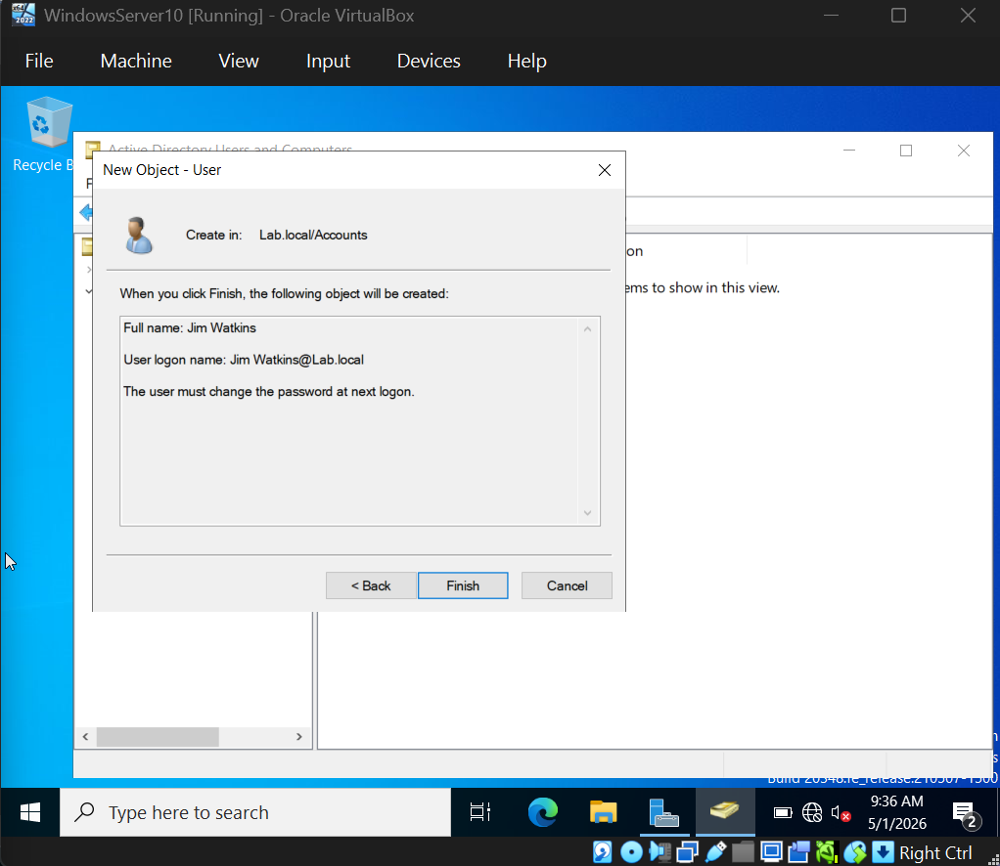
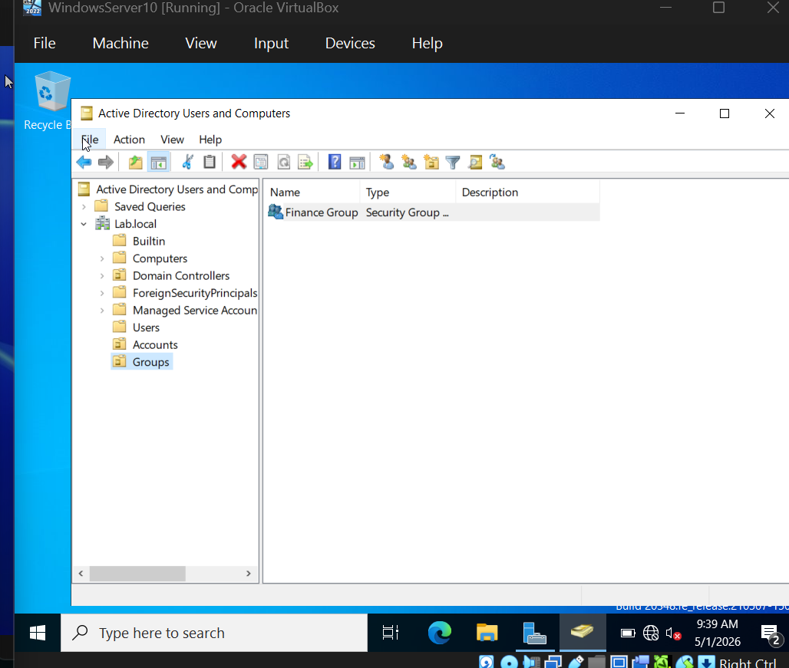
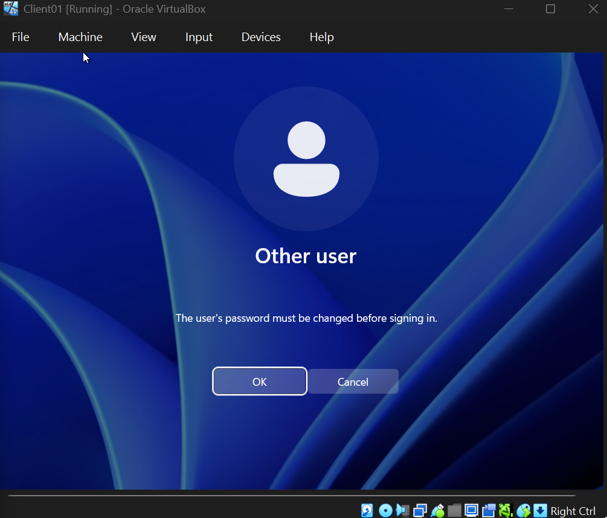
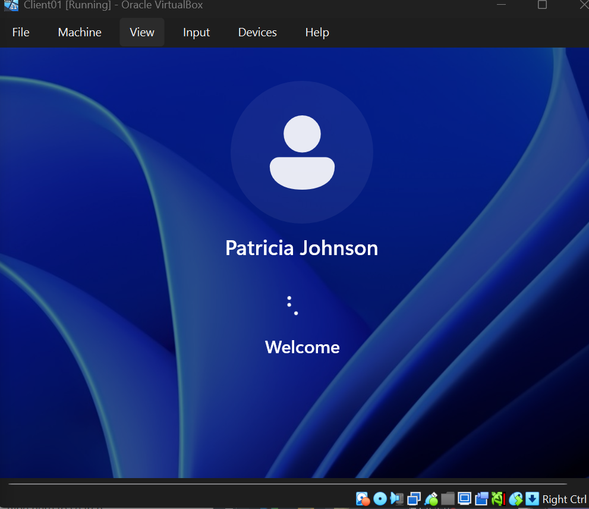
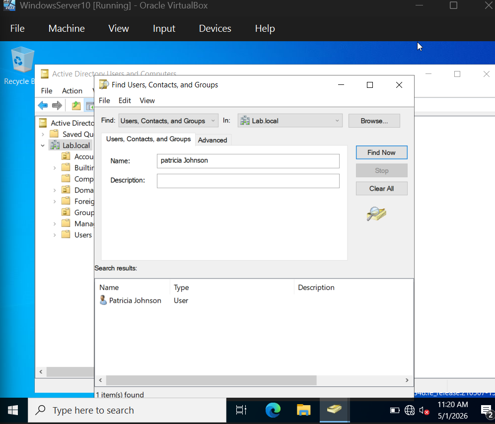
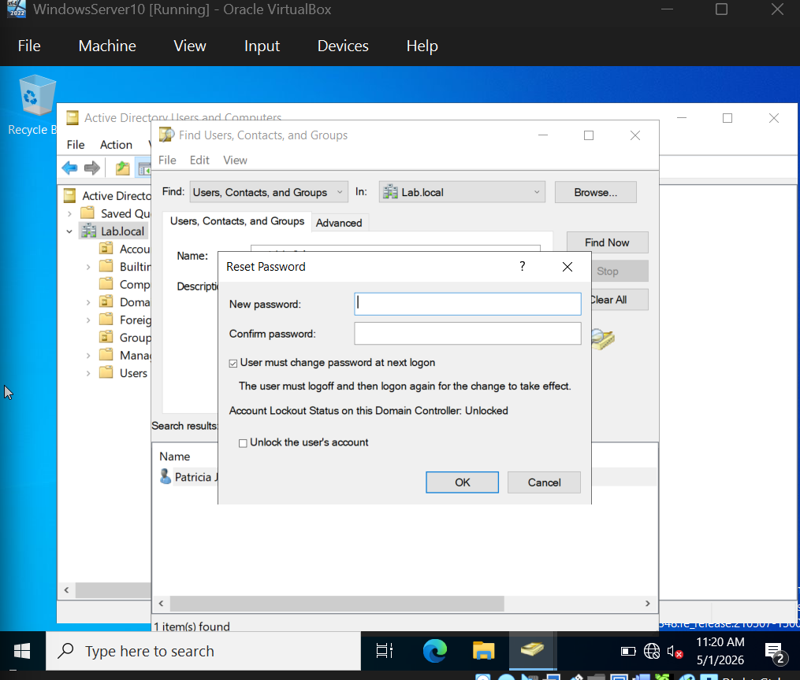
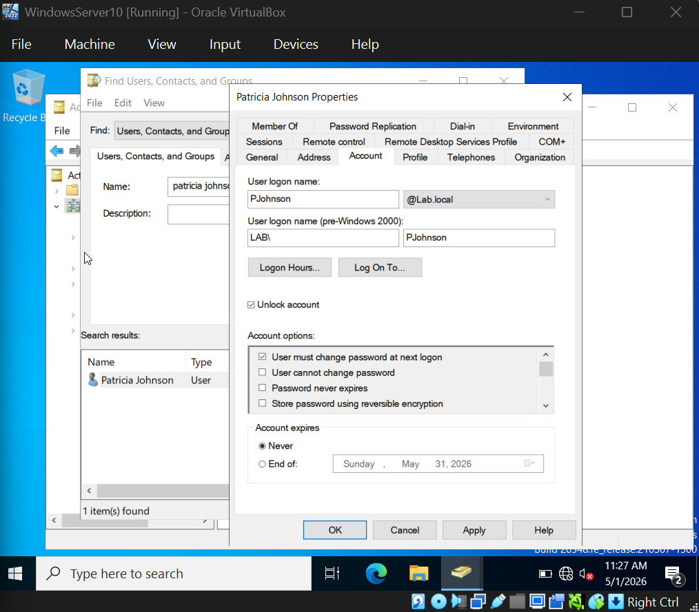

# 04 - Network Configuration, Domain Join & User Management

This section documents the configuration of Client01's network to integrate with the lab.local domain, the actual domain join process, and the creation and management of users, groups, and Organizational Units in Active Directory.

## Overview

After Section 03 established the Domain Controller, this section connects everything together. The Windows 11 client workstation must be configured to use the DC's DNS service before it can locate domain services and join the domain. Once joined, Active Directory becomes the central authority for user authentication and account management - a foundational skill set for any IT Help Desk role.

## Network Configuration on the Client

For the Windows 11 client to find and authenticate against the Domain Controller, its DNS server settings must point to DC01's IP address (192.168.56.10).

| Setting | Value |
|---------|-------|
| Preferred DNS Server | 192.168.56.10 (DC01) |
| Alternate DNS Server | (none) |

## Domain Join Process

With DNS correctly configured, the client could resolve `lab.local` and locate DC01. The domain join was performed through System Properties on Client01:

1. Opened System Properties (Win + R, typed `sysdm.cpl`, pressed Enter)
2. Clicked Change on the Computer Name tab
3. Selected Domain instead of Workgroup
4. Entered `lab.local` as the domain name
5. Provided domain administrator credentials when prompted

The join succeeded with a "Welcome to the Lab.Local domain" confirmation:

The client was then restarted to complete the join.

## Verification on the Domain Controller

Back on DC01, opening Active Directory Users and Computers confirmed that CLIENT01 had been registered as a domain-joined computer, appearing in the default Computers OU:

## Organizational Unit Structure

To organize accounts and groups in a way that mirrors real-world enterprise environments, custom Organizational Units (OUs) were created at the root of the lab.local domain:

- **Accounts** - Container for user accounts
- **Groups** - Container for security groups

The "Protect container from accidental deletion" option was enabled when creating each OU. This is a security best practice that prevents administrators from accidentally deleting OUs containing critical accounts.

## User Account Creation

Test users were created inside the Accounts OU using realistic names. The first user, Jim Watkins, was created with the standard logon name format. The "User must change password at next logon" option was enabled to enforce the security best practice that admins should never know user passwords.

After creating multiple users and a Finance security group:

## Domain User Login Verification

When Patricia Johnson attempted her first login, Windows correctly enforced the password change policy that was set at account creation:

After setting a new password, Patricia Johnson successfully logged into Client01 as a domain user, with her credentials authenticated by DC01:

This confirms the entire authentication chain works: Client01 contacted DC01, DC01 verified Patricia's credentials against Active Directory, and Active Directory authorized the login.

## Help Desk Operations: User Lookup

Finding users quickly is one of the most common Help Desk tasks. Active Directory Users and Computers includes a Find function that searches across the entire domain:

## Help Desk Operations: Password Reset

Password resets are the most common Help Desk ticket. The Reset Password dialog includes important security options:

- **User must change password at next logon** - Forces the user to set their own password
- **Unlock the user's account** - Clears any existing lockout from failed login attempts

The "Account Lockout Status" displayed in the dialog shows whether the account is currently locked - useful for diagnosing login issues.

## User Properties and Account Management

The Account tab in user properties includes the User logon name (modern UPN format), Pre-Windows 2000 logon name (legacy NetBIOS format), Account options like password policies and expiration settings, and Account expiration date.

Help Desk technicians frequently modify these settings - enabling a disabled account, extending expiration dates, or unlocking accounts.

## Lessons Learned

DNS configuration is the foundation of domain join. Without the client's DNS pointing to the Domain Controller, no other step works because the client cannot find the domain services.

The "User must change password at next logon" option is a critical security control. By enforcing it, administrators never know user passwords, which protects both the user and the organization.

The structure of OUs becomes the foundation for everything else in Active Directory. Group Policy Objects, delegated administrative permissions, and reporting all rely on a well-organized OU hierarchy.

## Final State

After this section, the lab has Client01 successfully joined to lab.local with domain authentication working end-to-end, custom Organizational Units created with accidental deletion protection, multiple test users with realistic names and forced password changes, a Finance security group ready for resource permission assignments, and demonstrated Help Desk workflows including user lookup, password resets, and account management.

## Next Section

05 - Group Policy Objects: Configuring GPOs to enforce security policies, password complexity requirements, account lockout thresholds, and user environment settings across the domain.
